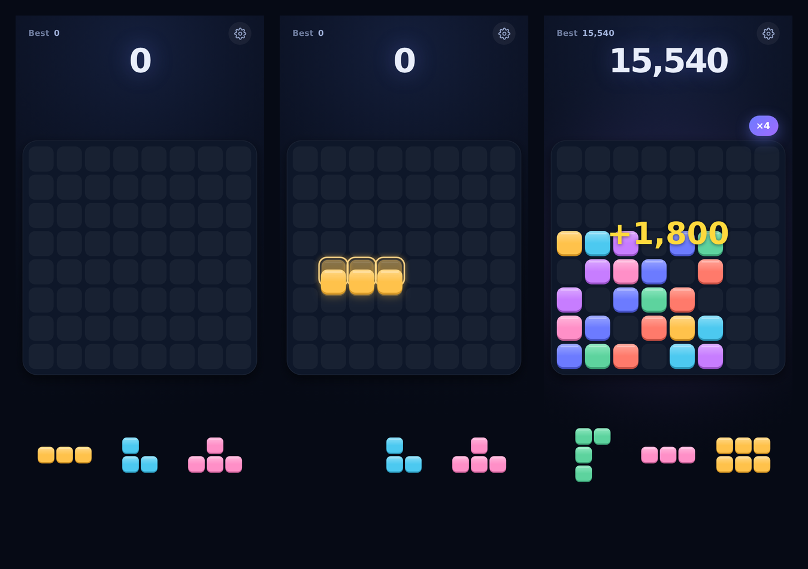

# Prism

**[Play it →](https://michaelaglen.github.io/Prism/)**

A block puzzle built for one thumb. Drag a piece onto the board, complete a row
or column, watch it go. The game ends when none of your three pieces fit.

Installable as a phone app, playable with no signal, with a real global
leaderboard.



---

## Playing

Drag one of the three pieces onto the 8×8 board. Fill a whole row or column and
it clears. Pieces do not rotate — you place them as they come. When none of the
three will fit anywhere, the run is over.

Clear on consecutive turns to build a combo; the multiplier climbs to ×6, and
the board gets louder and brighter as it goes.

| | |
|---|---|
| Placing a piece | 1 point per cell |
| One line | 100 |
| Two at once | 250 |
| Three | 450 |
| Four | 700 |
| Combo | ×1.5, ×2, ×2.5 … up to ×6 |

No lives, no timers, no energy, no currencies, no ads. One screen.

**Install it:** on iOS, Share → Add to Home Screen. On Android, Chrome offers to
install it. It then runs fullscreen and works offline.

---

## What makes it feel the way it does

**The piece never sits under your thumb.** It rides above your fingertip at true
board scale, with a glowing outline locked to the grid below showing exactly
where it will land. If the placement would complete a line, that whole row or
column lights up before you commit.

**The pieces you get are not random.** Every tray is chosen by simulating
candidates against the live board: can all three actually be played out, and how
much could they clear? The game is generous for the first few turns, then fades
that help away as your score climbs — a curve you are not supposed to notice.
There is a small "mercy" budget that raises the odds of something useful when
the board is drowning, but it depletes each time it is spent and recovers only
while you are comfortable. It nudges; it never guarantees survival.

In 180 simulated games, runs ended with the board about 57% full — meaning games
finish because the board became strategically awkward, not because it jammed
shut or because the generator handed over garbage.

**Sound is synthesised, not sampled.** Every tone is generated in the browser, so
there are no audio files to download and it all works offline from the first tap.
Combos walk up a pentatonic scale, so the pitch rises naturally as a streak
builds.

**Nothing waits on the network.** The result screen appears the instant you lose,
with your score, best and games played. The rank arrives whenever it arrives.

---

## How it works

Pure front end. One self-contained `index.html` — no framework, no build step,
no dependencies, nothing loaded from a CDN. The board, pieces, particles and
effects are drawn on a single canvas; the menus are ordinary HTML.

### Accounts

There is no sign-up. Pressing **Play** the first time creates an anonymous
Supabase account behind the scenes and stores your chosen name against it. Come
back later and the session is reused, so you land straight on a board. Names are
display-only and need not be unique — the account ID is the real identity.

### Scores

Every game gets a UUID when it starts, and records the random seed that drove it
plus every placement you made. On game over that run goes into a local queue
first, then gets submitted.

The browser **cannot** write a score. There is no permission for it anywhere in
the database. Scores enter only through a server-side function that checks who is
calling, validates the run, stores it, and recalculates the leaderboard. Because
the run ID is the primary key, retrying a submission is harmless — which is what
makes the offline queue safe.

Lose your connection mid-game and nothing breaks: the run is kept on the device
and sends itself on the next launch, when the connection returns, or after any
later successful submission.

### The leaderboard is real

One row per player, ranked by personal best. If there are eleven players, there
are eleven rows. No filler names, no invented population, no fake percentile. If
the rank cannot be fetched, the game says so rather than guessing.

### Reproducible runs

Gameplay randomness and visual randomness are deliberately separate. A seeded
generator drives piece selection and nothing else; colours, particles and screen
shake use ordinary randomness. So a seed plus a move list replays a run exactly,
which is what lets the server verify scores properly later.

---

## Running your own

```bash
git clone https://github.com/michaelaglen/Prism.git
cd Prism
python3 -m http.server 8000
```

It plays immediately. Without a backend it runs local-only: scores save to the
device and the leaderboard says it is not set up.

To connect your own Supabase project, follow **[SETUP.md](SETUP.md)** — enable
anonymous sign-ins, run `supabase/schema.sql`, deploy `supabase/submit-run.ts`,
and paste your project URL and anon key into `config.js`.

Hosting is GitHub Pages, served straight from the repo. Every path is relative,
so it works from a sub-path with no configuration.

---

## Files

```
index.html         the whole game
config.js          your Supabase URL and anon key
sw.js              offline cache
manifest.webmanifest, icons/    makes it installable
supabase/schema.sql             tables, security rules, ranking
supabase/submit-run.ts          the guarded door scores come through
```

After changing anything, bump `CACHE` in `sw.js` (`prism-v3` → `prism-v4`) so
returning players get the update immediately instead of one load later.

---

## Notes and limits

- Portrait phones. It reflows down to 320px wide but was not designed for
  landscape or desktop.
- Haptics are Android-only in practice; iOS exposes no vibration API to web apps.
- iOS mutes web audio when the ringer switch is on silent. The app asks the
  system to treat its sound as playback audio, which works on recent versions.
- Accounts are anonymous, so clearing site data loses that player. Linking to a
  Google, Apple or email identity is a later addition — the Settings screen
  already has the row waiting for it.
- Score validation checks structure, bounds and plausibility rather than
  replaying the run. Everything needed for full replay is stored from day one.
